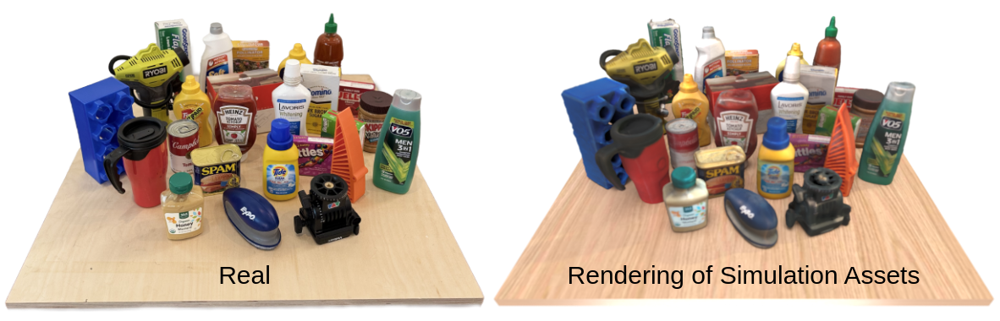

# Scalable Real2Sim: Physics-Aware Asset Generation Via Robotic Pick-and-Place Setups
Code for "Scalable Real2Sim: Physics-Aware Asset Generation Via Robotic Pick-and-Place Setups"

See our [project website](https://scalable-real2sim.github.io/) for more details. The paper is available on [arXiv](https://arxiv.org/abs/2503.00370).

An overview of our pipeline:


Some of our reconstructed assets:


## Installation

This repo uses Poetry for dependency management. To setup this project, first install
[Poetry](https://python-poetry.org/docs/#installation) and, make sure to have Python3.10
installed on your system.

Then, configure poetry to setup a virtual environment within the project directory:
```bash
poetry config virtualenvs.in-project true
```

Fetch the submodules:
```bash
git submodule init && git submodule update
```

Next, install all the required dependencies to the virtual environment with the
following command:
```bash
poetry install
```

Install BundleSDF (this may take a while & will create a .venv in the BundleSDF directory):
```bash
cd scalable_real2sim/BundleSDF/ && bash setup.bash
```

Download pretrained weights of LoFTR outdoor_ds.ckpt, and put it under
`scalable_real2sim/BundleSDF/BundleTrack/LoFTR/weights/outdoor_ds.ckpt`.

Install Colmap. See [here](https://colmap.github.io/install.html) for instructions.

Create a separate environment for Nerfstudio and install it:
```bash
python -m venv .venv_nerfstudio && \
source .venv_nerfstudio/bin/activate && \
pip install torch torchvision --index-url https://download.pytorch.org/whl/cu121 && \
pip install pip==23.0.1 && \
pip install git+https://github.com/NVlabs/tiny-cuda-nn/#subdirectory=bindings/torch && \
pip install git+https://github.com/nerfstudio-project/nerfstudio.git
```
Note that the old pip version is required for `tiny-cuda-nn` to work.

Install Frosting (this will create a .venv in the Frosting directory):
```bash
cd scalable_real2sim/Frosting/ && bash setup.bash
```

Install Neuralangelo (this will create a .venv in the Neuralangelo directory):
```bash
cd scalable_real2sim/neuralangelo/ && bash setup.bash \
&& git submodule init && git submodule update
```

## Code Organization

This repo is more of a collection of submodules. Yet, there are two main entrypoints,
one for data collection and one for asset generation. The data collection one is
robot setup dependent and might thus not run out of the box. The asset generation should
be runnable as is, provided all dependencies are installed correctly.

### Pipeline Entrypoints

The real2sim pipeline is split into two main scripts:
- `run_data_collection.py`
- `run_asset_generation.py`

#### run_data_collection.py

Script for collecting all the data needed for asset generation. Runs in a loop until
the first bin is empty.

#### run_asset_generation.py

Script for generating assets from the data collected by `run_data_collection.py`.

Having this separate from the data collection script allows the robot to collect data
non-stop without having to pause for computationally intensive data processing. 
The asset generation could then, for example, happen in the cloud.

### Scripts

Contains additional scripts that might be useful. For example, this includes scripts
for computing evaluation metrics.

#### compute_geometric_metrics.py

Script for computing geometric error metrics between a GT and reconstructed visual
mesh.

#### segment_moving_obj_data.py

Our segmentation pipeline for obtaining object and gripper masks. You might want to
do human-in-the-loop segmentation by annotating specific frames with positive/ negative
labels for more robust results. We provide a simple GUI for this purpose. The default
automatic annotations using DINO work well in many cases but can struggle with the
gripper masks. All downstream object tracking and reconstruction results are sensitive
to the segmentation quality and thus spending a bit of effort here might be worthwhile.

### Submodules

#### robot_payload_id

Contains all our system identification code:
- Optimal excitation trajectory design
- Robot identification
- Payload identification

#### BundleSDF

A SOTA object tracking method.
Please see the [BundleSDF GitHub]([https://github.com/zju3dv/BundleSDF](https://github.com/NVlabs/BundleSDF)).

Our fork improves the geometric reconstruction and texture mapping quality.

#### nerfstudio

A collection of SOTA NeRF methods.
Please see the [nerfstudio GitHub](https://github.com/nerfstudio-project/nerfstudio).

All our alpha-transparent training code is already merged into the main branch.

#### neuralangelo

A SOTA neural surface reconstruction method.
Please see the [neuralangelo GitHub](https://github.com/NVlabs/neuralangelo).

Our fork adds masking and alpha-transparent training.

#### Frosting

A SOTA surface reconstruction method using Gaussian Splatting.
Please see the [Frosting GitHub](https://github.com/Anttwo/Frosting).

Our fork adds masking, alpha-transparent training, and depth supervision.

## Running the pipeline

### 1. Generate an optimal excitation trajectory

This trajectory needs to be generated once per environment as it considers the robot's
position/ velocity/ acceleration limits, enforces non-penetration constraints with
the environment, and enforces self-collision avoidance.

The trajectory optimization can be run with
`scalable_real2sim/robot_payload_id/scripts/design_optimal_excitation_trajectories.py`.
See [here](https://github.com/nepfaff/robot_payload_id?tab=readme-ov-file#optimal-experiment-design)
for more details and recommended script parameters.

### 2. Run data collection

The initial robot data can be collected with **Script TBC**. This
needs to be done once per environment.

The object data collection can be run with `scalable_real2sim/run_data_collection.py`.

### 3. Run robot identification

The robot identification can be run with
`scalable_real2sim/robot_payload_id/scripts/identify_robot_at_multiple_gripper_oppenings.py`.

Note that this needs to be done once per environment for the robot data from step 2.

### 4. Run asset generation

The asset generation can be run with `scalable_real2sim/run_asset_generation.py`.

## Figures

The paper robot figures were created with the help of
[drake-blender-recorder](https://github.com/nepfaff/drake-blender-recorder).

## Citation

If you find this work useful, please cite our paper:
```bibtex
@article{pfaff2025_scalable_real2sim,
    author        = {Pfaff, Nicholas and Fu, Evelyn and Binagia, Jeremy and Isola, Phillip and Tedrake, Russ},
    title         = {Scalable Real2Sim: Physics-Aware Asset Generation Via Robotic Pick-and-Place Setups},
    year          = {2025},
    eprint        = {2503.00370},
    archivePrefix = {arXiv},
    primaryClass  = {cs.RO},
    url           = {https://arxiv.org/abs/2503.00370},
}
```
